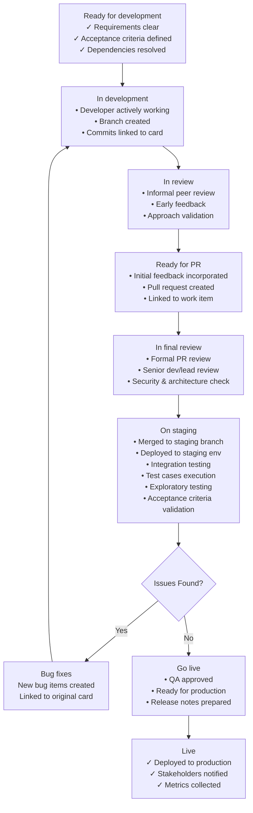

```mermaid
flowchart TD
    Ready[Ready for development<br/>✓ Requirements clear<br/><nobr>✓ Acceptance criteria defined</nobr><br/>✓ Dependencies resolved]

    Ready --> InDev[In development<br/><nobr>• Developer actively working</nobr><br/>• Branch created<br/>• Commits linked to card]

    InDev --> InReview[In review<br/>• Informal peer review<br/>• Early feedback<br/>• Approach validation]

    InReview --> ReadyPR[Ready for PR<br/><nobr>• Initial feedback incorporated</nobr><br/>• Pull request created<br/>• Linked to work item]

    ReadyPR --> FinalReview[In final review<br/>• Formal PR review<br/>• Senior dev/lead review<br/><nobr>• Security & architecture check</nobr>]

    FinalReview --> OnStaging[On staging<br/>• Merged to staging branch<br/>• Deployed to staging env<br/>• Integration testing<br/>• Test cases execution<br/>• Exploratory testing<br/>• Acceptance criteria validation]

    OnStaging --> Issues{Issues Found?}
    Issues -->|Yes| BugFix[Bug fixes<br/>New bug items created<br/>Linked to original card]
    BugFix --> InDev

    Issues -->|No| GoLive[Go live<br/>• QA approved<br/>• Ready for production<br/>• Release notes prepared]

    GoLive --> Live[Live<br/>✓ Deployed to production<br/>✓ Stakeholders notified<br/>✓ Metrics collected]
```
