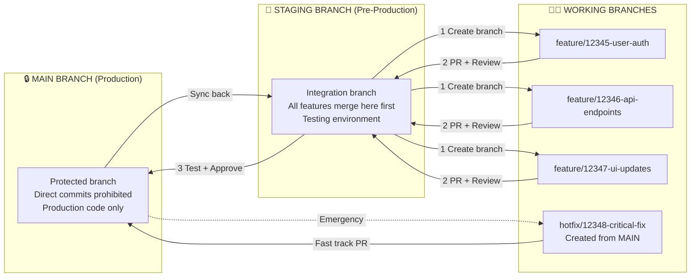

```mermaid
flowchart LR
    subgraph Production["🔒 MAIN BRANCH (Production)"]
        Main[Protected branch<br/>Direct commits prohibited<br/>Production code only]
    end

    subgraph PreProd["🧪 STAGING BRANCH (Pre-Production)"]
        Staging[Integration branch<br/>All features merge here first<br/>Testing environment]
    end

    subgraph Development["👨‍💻 WORKING BRANCHES"]
        Feature1[feature/12345-user-auth]
        Feature2[feature/12346-api-endpoints]
        Feature3[feature/12347-ui-updates]
        Hotfix[hotfix/12348-critical-fix<br/>Created from MAIN]
    end

    Staging -->|&nbsp;1 Create branch&nbsp;| Feature1
    Staging -->|&nbsp;1 Create branch&nbsp;| Feature2
    Staging -->|&nbsp;1 Create branch&nbsp;| Feature3

    Feature1 -->|&nbsp;2 PR + Review&nbsp;| Staging
    Feature2 -->|&nbsp;2 PR + Review&nbsp;| Staging
    Feature3 -->|&nbsp;2 PR + Review&nbsp;| Staging

    Staging -->|&nbsp;3 Test + Approve&nbsp;| Main
    Main -.->|&nbsp;Emergency&nbsp;| Hotfix
    Hotfix -->|&nbsp;Fast track PR&nbsp;| Main
    Main -->|&nbsp;Sync back&nbsp;| Staging
```
