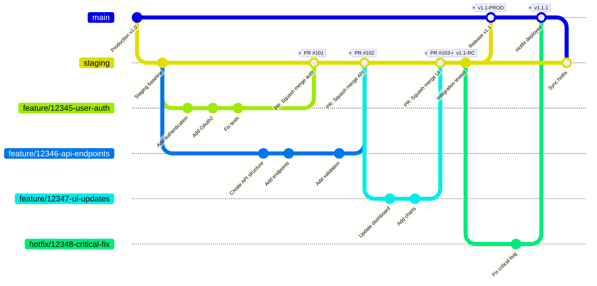

```mermaid
gitGraph
    commit id: "Production v1.0"
    branch staging
    checkout staging
    commit id: "Staging baseline"
    
    branch feature/12345-user-auth
    checkout feature/12345-user-auth
    commit id: "Add authentication"
    commit id: "Add OAuth2"
    commit id: "Fix tests"
    
    checkout staging
    branch feature/12346-api-endpoints
    checkout feature/12346-api-endpoints
    commit id: "Create API structure"
    commit id: "Add endpoints"
    
    checkout staging
    merge feature/12345-user-auth id: "PR: Squash merge auth" tag: "PR #101"
    
    checkout feature/12346-api-endpoints
    commit id: "Add validation"
    
    checkout staging
    merge feature/12346-api-endpoints id: "PR: Squash merge API" tag: "PR #102"
    
    branch feature/12347-ui-updates
    checkout feature/12347-ui-updates
    commit id: "Update dashboard"
    commit id: "Add charts"
    
    checkout staging
    merge feature/12347-ui-updates id: "PR: Squash merge UI" tag: "PR #103"
    
    commit id: "Integration tested" tag: "v1.1-RC"
    
    checkout main
    merge staging id: "Release v1.1" tag: "v1.1-PROD"
    
    checkout staging
    branch hotfix/12348-critical-fix
    checkout hotfix/12348-critical-fix
    commit id: "Fix critical bug"
    
    checkout main
    merge hotfix/12348-critical-fix id: "Hotfix deployed" tag: "v1.1.1"
    
    checkout staging
    merge main id: "Sync hotfix"
```
