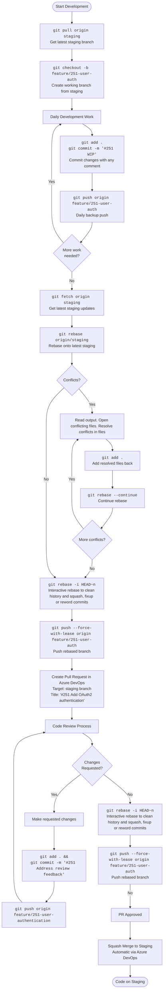

```mermaid
flowchart TD
    Start([Start Development]) --> Pull[<code>git pull origin staging</code><br/>Get latest staging branch]
    Pull --> CreateBranch[<code>git checkout -b feature/251-user-auth</code><br/>Create working branch from staging]
    CreateBranch --> DailyWork[Daily Development Work]

    DailyWork --> Commit[<code>git add .<br/>git commit -m '#251 WIP'</code><br/>Commit changes with any comment]
    Commit --> PushDaily[<code>git push origin feature/251-user-auth</code><br/>Daily backup push]
    PushDaily --> MoreWork{More work<br/>needed?}
    MoreWork -->|Yes| DailyWork
    MoreWork -->|No| FetchStaging[<code>git fetch origin staging</code><br/>Get latest staging updates]

    FetchStaging --> Rebase[<code>git rebase origin/staging</code><br/>Rebase onto latest staging]
    Rebase --> Conflicts{Conflicts?}

    Conflicts -->|Yes| ResolveConflicts[Read output. Open conflicting files. Resolve conflicts in files]
    ResolveConflicts --> AddResolved[<code>git add .</code><br/>Add resolved files back]
    AddResolved --> ContinueRebase[<code><nobr>git rebase --continue</nobr></code><br/>Continue rebase]
    ContinueRebase --> MoreConflicts{More conflicts?}
    MoreConflicts -->|Yes| ResolveConflicts
    MoreConflicts -->|No| InteractiveRebase

    Conflicts -->|No| InteractiveRebase[<code><nobr>git rebase -i HEAD~n</nobr></code><br/>Interactive rebase to clean history and squash, fixup or reword commits]

    InteractiveRebase --> ForcePush[<code>git push --force-with-lease origin feature/251-user-auth</code><br/>Push rebased branch]
    ForcePush --> CreatePR[Create Pull Request in Azure DevOps<br/>Target: staging branch<br/>Title: '#251 Add OAuth2 authentication']
    CreatePR --> Review[Code Review Process]
    Review --> ChangesRequested{Changes<br/>Requested?}

    ChangesRequested -->|Yes| MakeChanges[Make requested changes]
    MakeChanges --> CommitChanges[<code>git add . &&<br/>git commit -m '#251 Address review feedback'</code>]
    CommitChanges --> PushChanges[<code>git push origin feature/251-user-authentication</code>]
    PushChanges --> Review

    ChangesRequested -->|No| InteractiveRebase2[<code><nobr>git rebase -i HEAD~n</nobr></code><br/>Interactive rebase to clean history and squash, fixup or reword commits]
    InteractiveRebase2 --> Approved[<code>git push --force-with-lease origin feature/251-user-auth</code><br/>Push rebased branch]
    Approved -->|No| Approved2[PR Approved]
    Approved2 --> Merge[Squash Merge to Staging<br/>Automatic via Azure DevOps]
    Merge --> End([Code on Staging])
```
